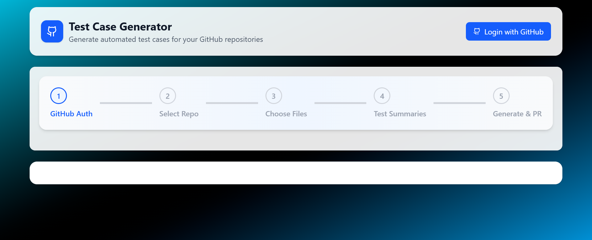

## Made By - Sayan Kundu

**B.Tech in Computer Science | Full Stack Developer | Passionate about building real-world solutions**

---

## 🔗 Links
[](https://drive.google.com/file/d/1Mhn6U396WW0DiciBdBbsP2eJP5P9CSg4/view?usp=drive_link)
[](https://www.linkedin.com/in/sayan-kundu-70b5442b6/)
[](https://github.com/sayank22)

---

# Dropbox Brand Animation Demo

Live Demo: [https://testcase-generator-sayan-kundu.vercel.app/](https://testcase-generator-sayan-kundu.vercel.app/)

---

# AI TestCase Generator With Github Integration

This Test Case Generator integrates with GitHub to fetch project files and lets users select multiple files for analysis. Using AI, it generates suggested test case summaries and then produces full test code (e.g., JUnit, Pytest, or Selenium) for the chosen scenarios. The generated tests are displayed in the UI, where users can review and confirm. With a single click, the app creates a new branch and raises a pull request on GitHub containing the new test cases, streamlining the testing workflow.

## Features

- **GitHub Integration:**  
Connect your GitHub account and browse repositories with all code files displayed in a clean UI.

- **AI-Powered Test Suggestions:**  
  Automatically generates multiple test case summaries for selected files using AI.

- **Multi-File Selection:**  
  Select one or more files at a time for generating test scenarios.

- **On-Demand Test Code Generation:**  
  Convert selected summaries into full test case code e.g., JUnit, Pytest, Selenium.

- **Interactive UI:**  
  Preview generated test code before finalizing.

  - **Pull Request Automation:**  
  Create a new branch and open a GitHub pull request with the generated test cases in just one click.

  - **Seamless Workflow:**  
  Simplifies testing by combining AI-driven test creation with direct GitHub collaboration.


---

## 🚀 Technologies I Used

**Frontend:**
 ⚛️ React, 📦 Vite

**Backend:**
 🛠️ Node.js, 🚀 Express, GitHub OAuth for authentication, OpenAI/Gemini API for AI-powered test case generation

**UI/UX:** 
🎞️ Framer Motion, 🎨 Tailwind CSS, 📱 Fully Responsive Design

**Other Tools & Services::** 
GitHub REST API (list files, create branches, commits, and PRs), 
dotenv for environment variable management, 
Axios for GitHub + AI API integration

**Frontend Deployment:**
 ▲ Vercel

**Backend Deployment:**
 🌐 Render

---

## 🌐 Live Links

**🔗 Frontend: testcase-generator-sayan-kundu.vercel.app**
**🔗 Backend API: https://jivaka-backend.onrender.com**

---


## Getting Started

# 1. Clone the repo
   ```bash
   git clone https://github.com/sayank22/Jivaka.git
   ```

# 2. Backend Setup
   ```bash
  cd server
npm install

   ```
**Create a .env file in /Server:**
```ini
PORT=5000


npm run dev

```

# 3. Frontend Setup
   ```bash
  cd client
npm install

   ```
**Create a .env file in /client:**
```ini
VITE_API_URL=https://your-backend-url.com

```
**Run the server:**
```bash

npm run dev

```

## Demo

See it live: [testcase-generator-sayan-kundu.vercel.app](testcase-generator-sayan-kundu.vercel.app)



